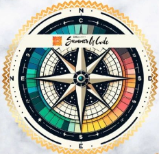

## Hi there 👋

<h1 align="center">Hi 👋, I'm Hema Laithambica Mypala</h1>
<h3 align="center">Tech enthusiast</h3>

  

  

- 🌱 I’m currently learning **Full stack web development**

- 📫 How to reach me **mhlambica2006@gmail.com**

   

## Achievements:

  

    <table>
      <tr>
        <td>
          
        </td>
        <td>
          
        </td>
        <td>
          
        </td>
      </tr>
      <tr>
        <td>
          
        </td>
        <td>
          
        </td>
        <td>
          
        </td>
      </tr>
    </table>
  

<h3 align="left">Connect with me:</h3>

<h3 align="left">Languages and Tools:</h3>

     

&nbsp;

